### 皆今日は！
I'm D.D. aka RozeFound aka Blind Bandit. The ALMIGHTY chibi Rimuru and blind earthbender fan. 

- I'm a native Russian speaker and fluent in English, learning Japanese in my spare time as well.
- I enjoy translating game mods (mostly Minecraft mods), sometimes software, and manga.
- Love to ~~suffer~~code in C++, occasionally speak Python. I also know a bit of Java, JS, C#, Lua, and would really like to learn Rust.
- I really like graphics programming, OPTIMIZATION, and automation. My dream is to automate all sorts of things, so I don't have to do anything and make it beautiful and performant :D

 

 <a href=https://github.com/stats-organization/github-readme-stats-action>
 <picture>
 <source
   srcset="./profile/stats/dark.svg"
   media="(prefers-color-scheme: dark)"
 />
 <source
   srcset="./profile/stats/light.svg"
   media="(prefers-color-scheme: light), (prefers-color-scheme: no-preference)"
 />
 
 </picture>
 </a> <a href=https://github.com/stats-organization/github-readme-stats-action>
 <picture>
 <source 
   srcset="./profile/top-langs/dark.svg"
   media="(prefers-color-scheme: dark)"
 />
 <source
   srcset="./profile/top-langs/light.svg"
   media="(prefers-color-scheme: light), (prefers-color-scheme: no-preference)"
 />
 
 </picture>
</a> 

